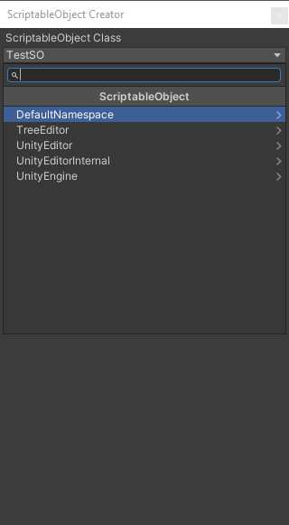
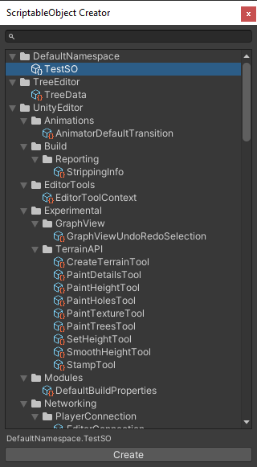
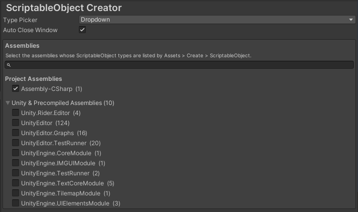

# ScriptableObject Creator

Create ScriptableObject assets from the Project window without writing a `[CreateAssetMenu]` attribute for every class.

**Assets > Create > ScriptableObject** opens a searchable picker listing the ScriptableObject classes in your project, grouped by namespace. Pick one and click **Create** to make a new `.asset` file in the current folder.

## Requirements

Unity 2019.4 or newer. The package is editor-only and adds nothing to builds.

## Installation

**From the Package Manager:** open **Window > Package Manager**, click **+**, choose **Add package from git URL...**, and enter:

```
https://github.com/lucasncs/scriptable-object-creator.git#1.0.0
```

To upgrade, change the tag to the newer version. Without a tag, Unity installs the latest commit on the default branch and keeps it locked there until you update it.

## Usage

### Creating an asset

#### From the picker window

1. In the Project window, open the folder where the asset should go.
2. Choose **Assets > Create > ScriptableObject** (also on the Project window's right-click menu).
3. Pick a class and click **Create**.
4. Name the new asset and press Enter.

#### From shortcut

There's the option to create directly from any ScriptableObject script, even if that script's assembly isn't selected in the settings.

1. In the Project window, select a ScriptableObject script.
2. Choose **Assets > Create > ScriptableObject** (also on the Project window's right-click menu).
3. Then creates an instance of that class directly, without opening the picker.
4. Name the new asset and press Enter.

### Type pickers

There are two pickers. Choose between them in the settings.

- **Dropdown:** a compact window with a popup like Unity's *Add Component* menu. Namespaces are groups you click into, and typing in the search box lists matching classes from every namespace.
- **Tree View:** a larger window with a search field above a tree of namespaces and classes. Type part of a class name and press Enter to create the first match, or use ↓ and the arrow keys to move through the tree. Double-click a class to create it.

| Dropdown | Tree View |
| :---: | :---: |
|  |  |

### Which classes are listed

The pickers list concrete ScriptableObject classes from the assemblies selected in the settings. These are left out:

- abstract classes and open generic classes
- `EditorWindow` and `Editor` subclasses
- the package's own classes

## Settings

Open **Edit > Project Settings > ScriptableObject Creator**.



| Setting | Default | Description |
| --- | --- | --- |
| **Type Picker** | Dropdown | Which picker **Assets > Create > ScriptableObject** opens. |
| **Auto Close Window** | On | When on, the picker opens as a floating utility window and closes after creating an asset. When off, it opens as a regular window that can be docked and stays open, so you can create several assets in a row. |
| **Assemblies** | `Assembly-CSharp` | The assemblies whose classes the pickers list. |

The assembly list is split in two:

- **Project Assemblies:** `Assembly-CSharp`, your own assembly definitions, and packages that don't come from Unity.
- **Unity & Precompiled Assemblies:** Unity's own assemblies and packages, and precompiled DLLs. This section starts collapsed.

Each assembly shows how many classes it would add. Use the filter field to find one by name.

Settings are saved per project in `ProjectSettings/ScriptableObjectCreatorSettings.asset`. Commit that file to share them with your team.
